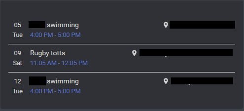
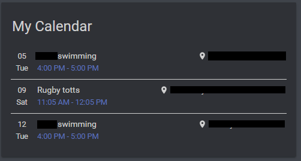
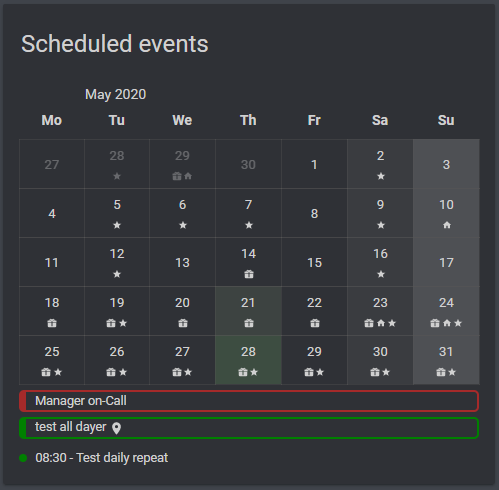

# Basic Configuration

This example is the most basic implementation, it will just show you a list of events
```yaml
- type: "custom:atomic-calendar-revive"
  entities:
    - entity: calendar.YOUR_CALENDAR_HERE
```




## With Name

```yaml
- type: "custom:atomic-calendar-revive"
  name: "My Calendar"
  entities:
    - entity: calendar.YOUR_CALENDAR_HERE
```



## With Calendar Mode Enabled

```yaml
- type: "custom:atomic-calendar-revive"
  name: "My Calendar"
  entities:
    - entity: calendar.YOUR_CALENDAR_HERE
      type: icon1
      color: green
    - entity: calendar.YOUR_CALENDAR1_HERE
      type: icon2
      color: red
    - entity: calendar.YOUR_CALENDAR2_HERE
      type: holiday
      color: blue
  enableModeChange: true

```




### With both Events mode and Calendar mode, calendar is default:
```yaml
- type: "custom:atomic-calendar-revive"
  name: "Calendar"
  enableModeChange: true
  defaultMode: 2
  CalEventIcon1Filter: birthday
  CalEventIcon2Filter: waste,bills
  entities:
  - entity: calendar.YOUR_CALENDAR_HERE
    type: icon2
  - entity: calendar.YOUR_CALENDAR1_HERE
	  type: icon1,icon2
  - entity: calendar.YOUR_CALENDAR2_HERE
    type: holiday
```
