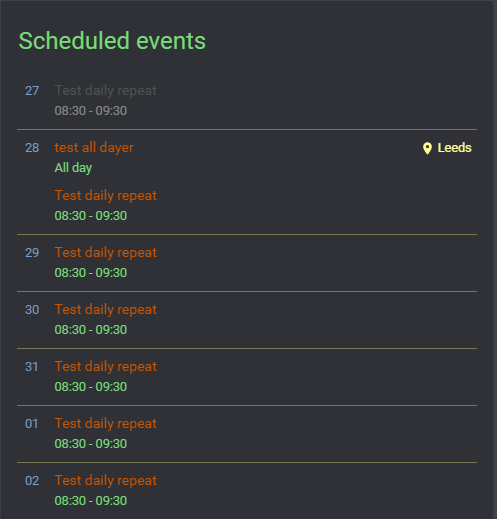
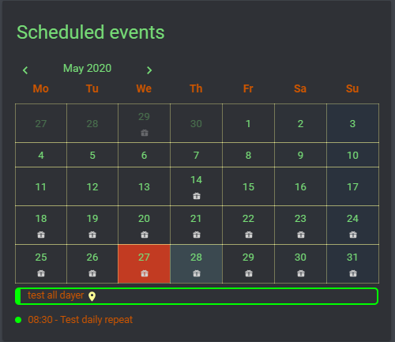

# Terminal

This color theme makes the calendar look like a terminal window.

## Screenshots




## Code

```yaml
dateColor: "rgb(119,158,203)"
timeColor: "rgb(119,221,119)"
eventTitleColor: "#cc5500"
locationLinkColor: "rgb(253, 253, 150)"
locationIconColor: "rgb(253, 253, 150)"
dayWrapperLineColor: "rgba(253, 253, 150, .35)"
descColor: "#00FF00"
eventCalNameColor: "#1E90FF"
calGridColor: "rgba(253, 253, 150, .35)"
calEventBackgroundColor: "rgb(194, 59, 34)"
calEventSatColor: "rgba(12, 56, 100, .05)"
calEventSunColor: "rgba(12, 56, 100, .15)"
calActiveEventBackgroundColor: "rgba(128, 206, 225, .15)"
defaultCalColor: "#00FF00"
calDayColor: "rgb(119,221,119)"
nameColor: "rgb(119,221,119)"
calWeekDayColor: "#cc5500"
calDateColor: "rgb(119,221,119)"
```
